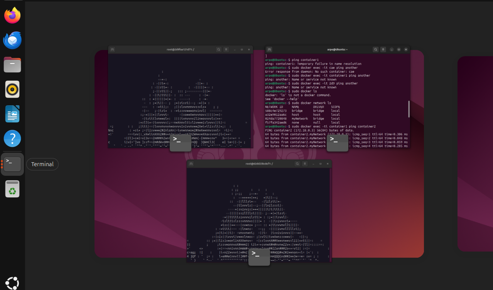
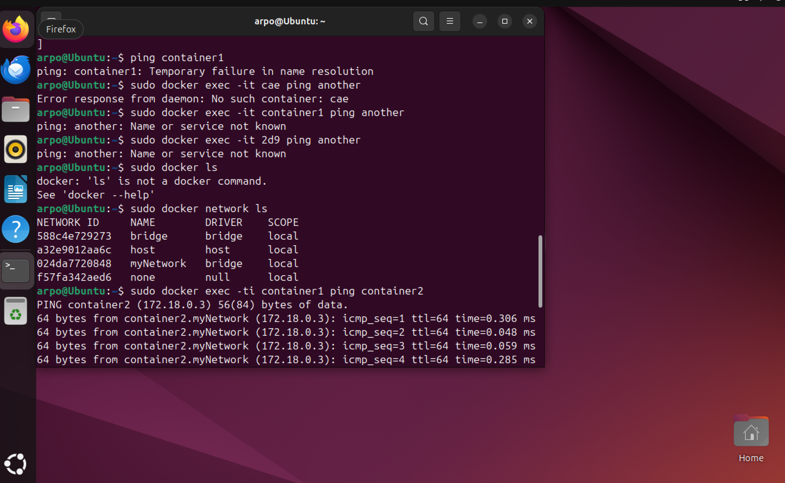

# Лабораторная работа №4

Я создал Dockerfile. Его содержание:
```
FROM ubuntu:latest
RUN apt-get update && apt-get install libaa-bin iputils-ping
```

Создал образ aafire-image:
```
docker build -t aafire-image .
```

Cоздал container1 и container2:
```
docker run -it --name container1 aafire-image
docker run -it --name container2 aafire-image
```

Запустил aafire в двух терминлах. Создал сеть и присоеденил к ней контейнеры. Проверил пинг между ними:


